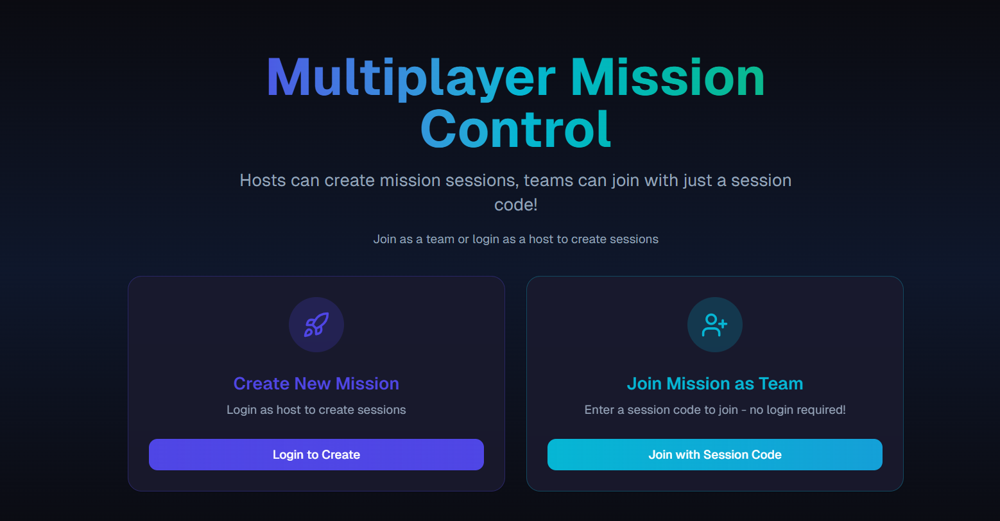
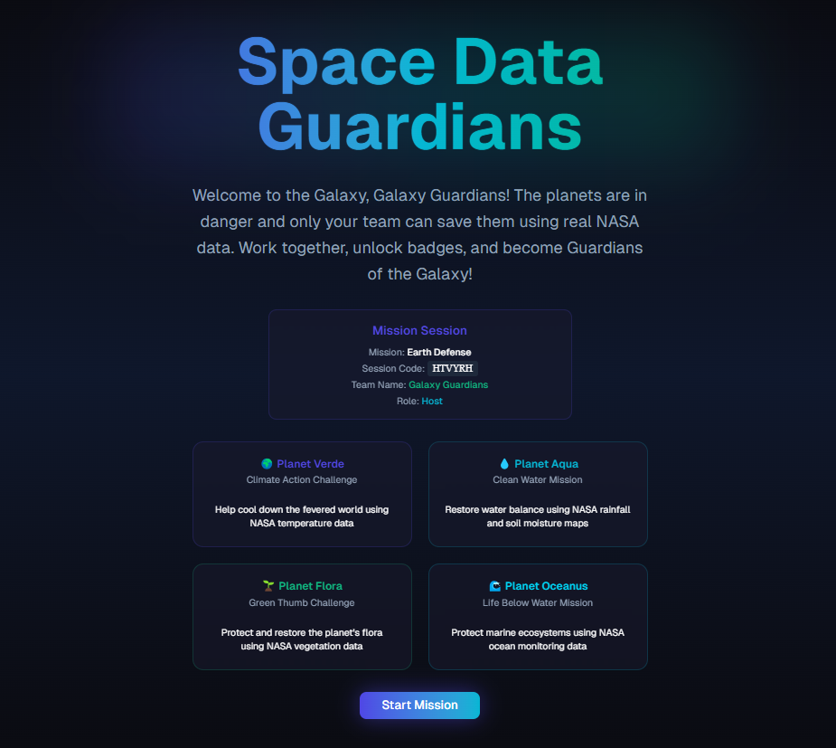
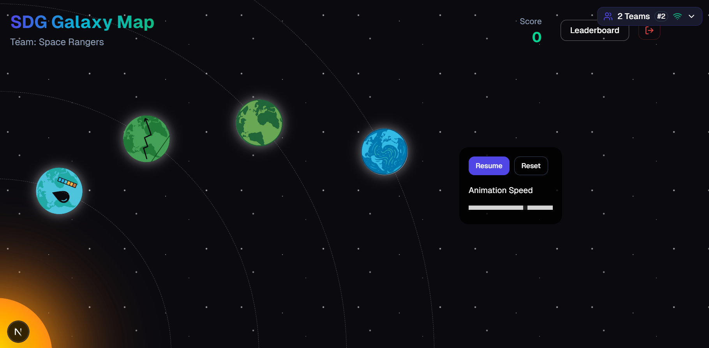
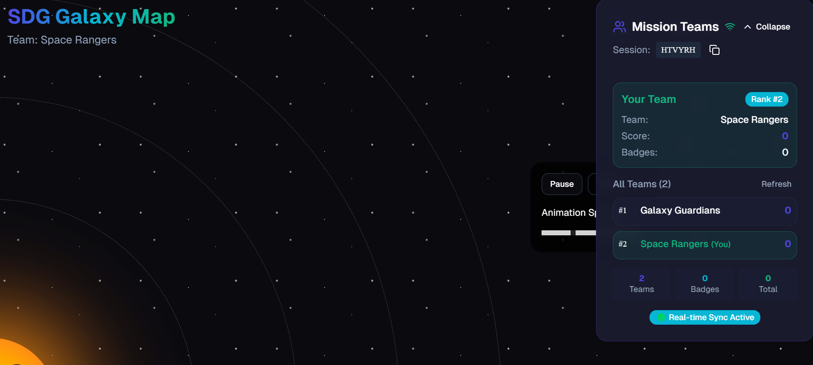
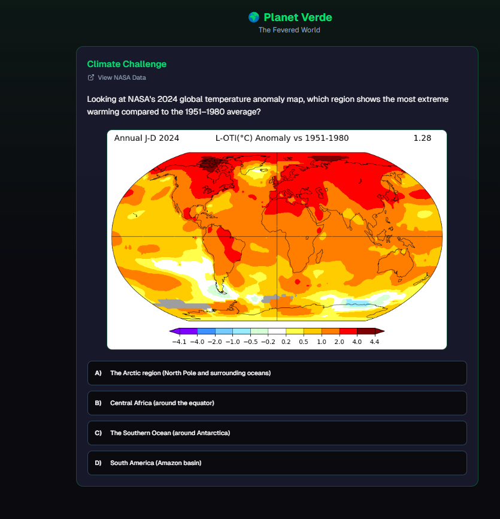
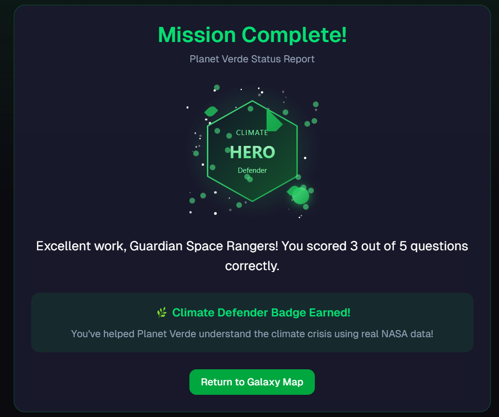
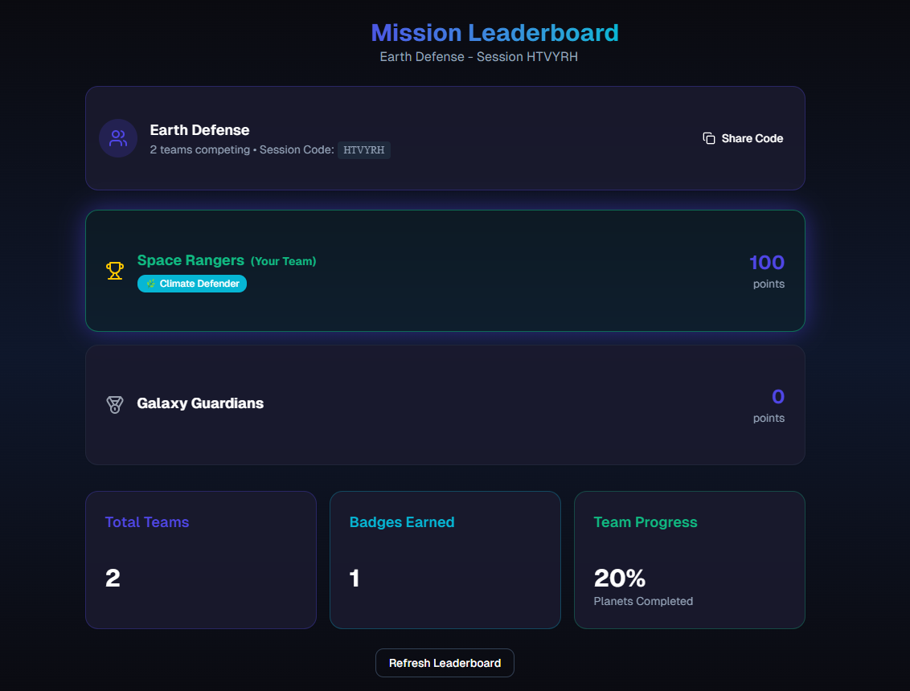

# SDG Galaxy - Multiplayer Mission Game

An interactive multiplayer game where teams explore planets and complete Sustainable Development Goals (SDG) missions together.

## Features

- **Multiplayer Sessions**: Create or join mission sessions with other teams
- **Real-time Updates**: See other teams' progress live with automatic refreshing
- **Interactive Planets**: Explore Planet Verde and Planet Aqua with engaging missions
- **Team Leaderboard**: Compete with other teams and track rankings
- **Badge System**: Earn badges for completing various SDG challenges
- **Live Notifications**: Get notified when other teams earn badges or score points

## Getting Started

### Prerequisites

- Node.js 18+ installed on your machine
- npm or yarn package manager

### Installation

1. **Download the project**
   - Click the three dots (⋯) in the top right of the v0 code block
   - Select "Download ZIP"
   - Extract to your desired location

2. **Install dependencies**
   ```bash
   cd sdg-galaxy-game
   npm install --legacy-peer-deps 
   ```

3. **Start the development server**
   ```bash
   npm run dev
   ```

4. **Open your browser**
   - Navigate to `http://localhost:3000`
   - The game will load and you can start playing!

### Alternative Setup Methods

**Via GitHub:**
1. Push the code to GitHub using the GitHub button in v0
2. Clone your repository locally
3. Follow steps 2-4 above

## How to Play Multiplayer

### Creating a Session
1. Click "Create New Mission" on the home screen
2. Enter your team name
3. Share the generated session code with other teams
4. Start exploring planets and earning badges!

### Joining a Session
1. Click "Join Existing Mission" on the home screen
2. Enter the session code provided by another team
3. Enter your team name
4. Join the multiplayer adventure!

### Gameplay
- **Explore Planets**: Click on Planet Verde or Planet Aqua to start missions
- **Complete Challenges**: Answer questions and complete activities to earn badges
- **Track Progress**: View the team panel to see real-time rankings
- **Compete**: Watch the leaderboard to see how your team compares to others


## Screen Shots
Mutliplayer control

Team Joining

Game Landing Page

Game session details

Planetary Quiz Example

Winning Badge example

Leaderboard

## Project Structure

```
sdg-galaxy-game/
├── app/
│   ├── page.tsx          # Main game entry point
│   ├── layout.tsx        # App layout and providers
│   └── globals.css       # Global styles
├── components/
│   ├── galaxy-map.tsx    # Main game interface
│   ├── planet-verde.tsx  # Planet Verde missions
│   ├── planet-aqua.tsx   # Planet Aqua missions
│   ├── leaderboard.tsx   # Multiplayer leaderboard
│   ├── session-manager.tsx # Session creation/joining
│   ├── team-panel.tsx    # Real-time team display
│   └── realtime-notifications.tsx # Live notifications
├── hooks/
│   └── use-realtime-session.ts # Real-time session management
└── README.md
```


## Technologies Used

- **Next.js 14** - React framework with App Router
- **TypeScript** - Type-safe development
- **Tailwind CSS** - Utility-first styling
- **Lucide React** - Beautiful icons
- **Local Storage** - Client-side data persistence

## Multiplayer Features

- **Session Management**: Create and join sessions with unique codes
- **Real-time Updates**: Automatic polling every 3 seconds for live data
- **Team Coordination**: See all teams in your session with live rankings
- **Live Notifications**: Get notified of other teams' achievements
- **Connection Status**: Visual indicators for real-time connection health

## Troubleshooting

**Game not loading?**
- Make sure you're running `npm run dev` and the server is active
- Check that port 3000 is available

**Multiplayer not working?**
- Ensure all team members are using the same session code
- Try refreshing the page if real-time updates stop working
- Check browser console for any error messages

**Teams not seeing each other?**
- Verify everyone joined the same session code
- Make sure localStorage is enabled in your browser
- Try creating a new session if issues persist


